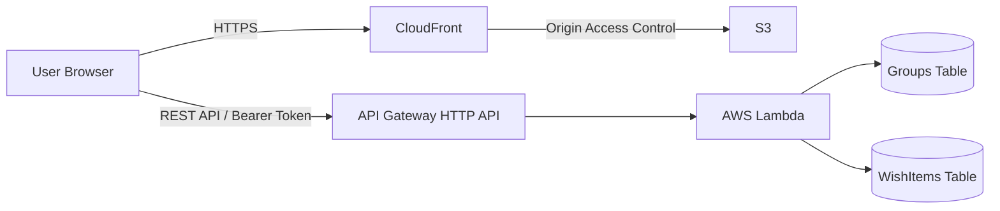

# Peace Wishlist

友人・家族・カップルなどの少人数グループで、「行きたい場所」「食べたいもの」「一緒にやりたいこと」を共有するWebアプリです。

アカウント登録やアプリのインストールは不要です。グループを作成して共有URLを送るだけで利用できます。

> [!NOTE]
> 主要機能とAWS環境は実装済みです。現在はUI/UXとデザインの設計・改善を進めています。

**公開URL:** https://d332kyk3k7fo1q.cloudfront.net/

<!-- UI/UXの設計後、アプリのスクリーンショットまたは短いGIFを追加する -->

## 背景・解決したい課題

友人と話している中で、「会話に出た行きたい場所や一緒にやりたいことを、後から見返せるアプリがあったらよい」という話になったことが開発のきっかけです。

LINEや日常会話で出た予定は、その場では盛り上がっても会話に流れて忘れてしまうことがあります。そこで、思いついた内容をすぐに登録し、少人数のグループで共有できるアプリを作成しました。

利用開始時の手間を減らすことを優先し、ユーザー登録やログインを必須にせず、共有URLを知っているメンバーが参加できる方式にしています。

## 主な機能

- グループの作成と共有URLの発行
- 共有URLからのグループ参加
- 表示名のブラウザ保存
- やりたいことの一覧表示・追加・編集・削除
- 登録時・更新時に入力された表示名の表示
- 作成日時の新しい順での一覧表示

## アーキテクチャ



フロントエンドの静的ファイルはS3へ配置し、CloudFront経由で配信しています。S3バケットのPublic Accessは無効化し、CloudFrontからS3へのアクセスにはOrigin Access Controlを使用しています。

APIはAPI Gateway HTTP APIとLambdaで構成し、データはDynamoDBへ保存しています。インフラストラクチャはAWS CDKで定義しています。

## 技術スタック

| 分類 | 技術 |
| --- | --- |
| Frontend | React, TypeScript, Vite, React Router |
| Backend | TypeScript, Node.js, AWS Lambda, API Gateway HTTP API |
| Database | Amazon DynamoDB |
| Infrastructure / Hosting | AWS CDK, Amazon S3, Amazon CloudFront |
| Monitoring / Cost | CloudWatch Logs, CloudWatch Alarms, Amazon SNS, AWS Budgets |
| Test / CI | Vitest, GitHub Actions, esbuild |

## 主な設計判断

### アカウント登録なしで共有できるアクセス方式

利用開始時の手間を減らすため、ログイン機能を設けず、グループごとに共有URLを発行しています。

グループ作成時に32バイトのランダムなアクセストークンを生成し、DynamoDBにはトークンそのものではなく、SHA-256でハッシュ化した値だけを保存します。APIアクセス時は、ブラウザから次の形式でトークンを送信します。

```http
Authorization: Bearer <accessToken>
```

Lambda側では受信したトークンを同様にハッシュ化し、DynamoDB上のハッシュ値と比較してアクセス可否を判定しています。

### アクセストークンをURLフラグメントで保持

当初はアクセストークンをクエリパラメータに含めていました。

```text
/groups/{groupId}?token={accessToken}
```

クエリパラメータはページ取得時のHTTPリクエストに含まれるため、CloudFrontなど、アクセストークンを必要としないコンポーネントにも送信されます。そのため、共有URLを次の形式へ変更しました。

```text
/groups/{groupId}#token={accessToken}
```

URLフラグメントはページ取得時にサーバーへ送信されません。React側でフラグメントからトークンを取得し、APIを呼び出すときだけ`Authorization`ヘッダーへ設定しています。

### アクセスパターンに合わせたDynamoDB設計

MVPで必要な主なアクセスパターンは次の3つです。

- `groupId`によるグループ取得
- `groupId`によるやりたいこと一覧の取得
- `groupId + itemId`による更新・削除

JOINや複雑な検索を必要とせず、Lambdaからの接続管理も不要であるため、DynamoDBを採用しました。また、オンデマンドキャパシティーモードを使用し、アクセスが少ない期間にも固定のキャパシティーを持たない構成にしています。

一方、複雑な検索・集計・リレーションが主要な要件となった場合は、RDBを含めてデータストアを再検討します。

### 永続化モデルとAPIレスポンスを分離

DynamoDBには、作成日時順で取得するための内部属性`createdAtItemId`を保存していますが、この属性はフロントエンドでは使用しません。

そこで、DynamoDBから取得したオブジェクトをそのまま返さず、APIレスポンス用の型へ変換してから返しています。DBへ内部管理用の属性を追加した場合も、意図せず外部APIへ公開されることを防ぎやすくしています。

### ドメインロジックと外部サービスへのアクセスを分離

入力値の検証やグループ・項目の生成といったドメインロジックを、LambdaのHandlerやDynamoDBへのアクセスから分離しています。

HandlerはRepositoryのインターフェースへ依存させ、テスト時にインメモリの実装へ差し替えられる構成にしています。これにより、AWS環境へ接続せずにドメインロジックとHandlerの振る舞いを検証できます。

## API

| Method | Endpoint | 概要 | 認証 |
| --- | --- | --- | --- |
| POST | `/groups` | グループ作成 | 不要 |
| GET | `/groups/{groupId}` | グループ取得 | Bearer Token |
| GET | `/groups/{groupId}/items` | やりたいこと一覧取得 | Bearer Token |
| POST | `/groups/{groupId}/items` | やりたいこと追加 | Bearer Token |
| PATCH | `/groups/{groupId}/items/{itemId}` | やりたいこと編集 | Bearer Token |
| DELETE | `/groups/{groupId}/items/{itemId}` | やりたいこと削除 | Bearer Token |

## データ設計

### Groups

| Attribute | 用途 |
| --- | --- |
| `groupId` | Partition Key |
| `groupName` | グループ名 |
| `accessTokenHash` | アクセストークンのハッシュ値 |
| `createdByDisplayName` | グループ作成時に入力された表示名 |
| `createdAt` | 作成日時 |

### WishItems

| Attribute | 用途 |
| --- | --- |
| `groupId` | Partition Key |
| `itemId` | Sort Key |
| `content` | やりたいこと |
| `createdByDisplayName` | 登録時に入力された表示名 |
| `updatedByDisplayName` | 最終更新時に入力された表示名 |
| `createdAt` | 作成日時 |
| `updatedAt` | 更新日時 |
| `createdAtItemId` | 作成日時順取得用のGSI Sort Key |

やりたいことを作成日時の新しい順で取得するため、次のGSIを設定しています。

```text
Index:         ItemsByCreatedAt
Partition Key: groupId
Sort Key:      createdAtItemId
```

`createdAtItemId`には`{createdAt}#{itemId}`を保存します。作成日時だけでなく`itemId`も含めることで、同一時刻に作成された項目がある場合もSort Keyを一意にしています。

## テスト・CI

GitHub Actionsにより、`main`ブランチへのpushと`main`ブランチを対象とするpull requestで自動検証を行っています。

| 対象 | CIでの検証内容 |
| --- | --- |
| Backend | Vitestによるテスト、TypeScriptの型チェック |
| Frontend | TypeScriptの型チェックを含むproduction build |
| Infrastructure | Frontend build、Infrastructure build、CDK synth |

InfrastructureのCIでは、LambdaのバンドルとフロントエンドのS3 Assetを含め、クリーンな環境からCloudFormationテンプレートを生成できることを確認しています。

## 開発環境での検証

### 前提

- Node.js 24
- npm

各ディレクトリで依存関係をインストールします。

```bash
cd backend
npm ci

cd ../frontend
npm ci

cd ../infra
npm ci
```

### Backend

```bash
cd backend
npm test
npx tsc --noEmit
```

### Frontend

起動またはビルドには、デプロイ済みAPIのURLを`VITE_API_BASE_URL`へ指定します。

```bash
cd frontend
VITE_API_BASE_URL=https://example.execute-api.ap-northeast-1.amazonaws.com npm run dev
```

```bash
cd frontend
npm run lint
VITE_API_BASE_URL=https://example.execute-api.ap-northeast-1.amazonaws.com npm run build
```

### Infrastructure

CDK synthでは`frontend/dist`をS3 Assetとして参照するため、先にFrontendをビルドします。また、通知先メールアドレスを`ALARM_EMAIL`へ指定します。

```bash
cd infra
npm run build
ALARM_EMAIL=example@example.com npx cdk synth
```

## 監視・コスト管理

公開環境では、次の項目を設定しています。

- LambdaのCloudWatch Logsを30日間保持
- Lambdaの`Errors`をCloudWatch Alarmで監視
- API Gatewayの5XXエラーをCloudWatch Alarmで監視
- Alarm発生時にSNS経由でメール通知
- AWS Budgetsで月額利用料金を監視

アプリケーション側で例外を捕捉してHTTP 500を返す場合、Lambdaの`Errors`メトリクスには現れません。そのため、Lambdaの実行エラーに加えてAPI Gatewayの5XXも監視しています。

CloudWatch AlarmとSNSはAWS CDKで管理し、AWS BudgetsはCDKとは別に設定しています。

## 現在の前提・制約

- 共有URLを知る少人数の信頼されたメンバーでの利用を前提としています。
- 共有URLを持つ利用者は、グループ内のすべての項目を追加・編集・削除できます。
- 表示名は利用者が入力した値であり、本人確認済みのユーザー情報ではありません。
- メンバーごとの権限管理、個別のアクセス無効化、アクセストークンの再発行には対応していません。
- やりたいことの一覧取得はページネーションに対応していないため、大量データを扱う用途は対象としていません。

## 今後の改善

- UI/UXとデザインの改善
- サーバー側の入力値制限と、不正・大量リクエストへの対策
- グループ削除とアクセストークン再発行
- DynamoDB TTLによる不要データの自動削除
- 一覧取得のページネーション
- エラーレスポンスと認証処理の共通化
- CI/CDによるデプロイの自動化

## Repository Structure

```text
peace-wishlist/
├── frontend/                 # React + TypeScript
├── backend/                  # Lambda + TypeScript
│   └── src/test/             # Backend tests
├── infra/                    # AWS CDK
└── .github/workflows/ci.yml  # GitHub Actions
```
