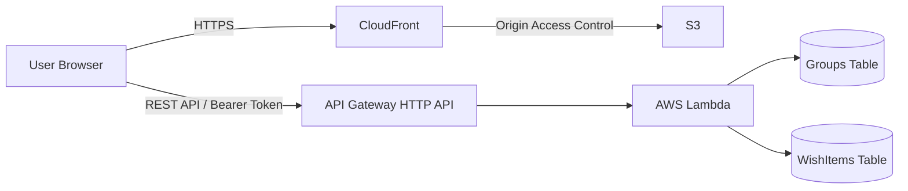

# Peace Wishlist

友人・家族・恋人などの少人数グループで、「行きたい場所」「食べたいもの」「一緒にやりたいこと」を忘れずに共有・管理するWebアプリです。

アカウント登録やアプリのインストールは不要です。グループを作成し、共有URLを送るだけで利用できます。

> [!NOTE]
> 主要機能、AWS環境、CI/CD、初期デザインは一通り完成しています。現在は友人による利用フィードバックを受け、機能とUI/UXを改善しています。第1回の改善では、項目の詳細情報機能追加とデザイン変更を行いました。

**公開URL:** https://d332kyk3k7fo1q.cloudfront.net/

## 解決したい課題

友人や家族との会話やLINEでは、「今度行きたい場所」「一緒に食べたいもの」「作ってみたいもの」といった話題がたびたび出ます。しかし、チャット上の情報は時間とともに流れ、一人のメモでは共有や更新も面倒なため、実行する前に忘れてしまうことがありました。

そこで、思いついた内容を一つのリストへ残し、少人数のメンバーで共同管理できるアプリを作成しました。

## 解決方法

- 会話で出た「今度やりたいこと」をグループごとのリストへ集約する
- ユーザー登録やログインを不要にし、思いついたときにすぐ登録できるようにする
- 共有URLを送るだけで、同じグループのメンバーが追加・編集・削除できるようにする

利用開始までの手間を減らすことを優先する一方、共有URLを知る利用者は同じ権限を持ちます。そのため、現時点では友人・家族など、少人数の信頼されたメンバーでの利用を前提としています。

## 使い方

1. グループ名と表示名を入力してグループを作成する
2. 発行された共有URLを一緒に使うメンバーへ送る
3. やりたいことを追加する
4. 一覧から詳細画面を開き、名前・コメント・URLを編集する

表示名はブラウザへ保存され、次回以降の入力に利用されます。

## 主な機能

- グループの作成と共有URLの発行
- 共有URLからのグループ参加
- やりたいことの一覧表示と専用詳細画面
- 名前・コメント・URLの追加と編集
- 登録済みURLを別タブで開く機能
- やりたいことの削除
- 登録者と最終更新者の表示
- 作成日時の新しい順での一覧表示
- 表示名のブラウザ保存

## アーキテクチャ



Frontendの静的ファイルはS3へ配置し、CloudFront経由で配信しています。APIはAPI Gateway HTTP APIとLambdaで構成し、データはDynamoDBへ保存しています。インフラストラクチャはAWS CDKで定義しています。

## 技術スタック

| 分類 | 技術 |
| --- | --- |
| Frontend | React, TypeScript, Vite, React Router |
| Backend | TypeScript, Node.js 24, AWS Lambda, API Gateway HTTP API, AWS SDK for JavaScript v3 |
| Database | Amazon DynamoDB |
| Infrastructure / Hosting | AWS CDK, AWS CloudFormation, Amazon S3, Amazon CloudFront |
| Build / Test / Lint | esbuild, Vitest, oxlint |
| CI/CD / Authentication | GitHub Actions, AWS IAM OIDC |
| Monitoring / Cost | CloudWatch Logs, CloudWatch Alarms, Amazon SNS, AWS Budgets |

## Backend設計の要点

### ログイン不要の共有方式

グループ作成時にランダムなアクセストークンを発行し、共有URLを知っているメンバーだけがグループへアクセスできる方式にしています。DynamoDBにはトークンそのものではなくSHA-256のハッシュ値を保存し、API呼び出し時はBearer Tokenとして検証します。

アクセストークンはURLのクエリパラメータではなくフラグメントへ含め、ページ取得時にCloudFrontなどへ送信されないようにしています。

### 利用規模に合わせたサーバーレス構成

当初は友人など少人数での利用を想定しており、アクセスのない時間にもサーバーを常時稼働させる必要はありません。そこで、運用負荷と初期コストを抑えるため、API Gateway、Lambda、DynamoDBによるサーバーレス構成を選択しました。DynamoDBはオンデマンドキャパシティーモードを使用しています。

### アクセスパターンから決めたデータ設計

MVPで必要な取得・更新方法を先に整理し、グループとやりたいことを別テーブルで管理しています。やりたいことは`groupId`単位で取得し、GSIを使って作成日時の新しい順に並べます。複雑な検索やリレーションが主要要件になった場合は、RDBを含めて再検討します。

API、認可、DynamoDB、責務分離の詳細は[Backend設計](docs/backend-design.md)に記載しています。

## 品質と運用

- BackendのドメインロジックとHandlerをVitestで自動テスト
- AWSリソースをCDKでコード化
- pull requestと`main`へのpush時に、テスト・型チェック・build・CDK synthを実行
- `main`のCI成功後、GitHub ActionsからAWSへ自動デプロイ
- GitHub ActionsからAWSへの認証にはOIDCを使用し、固定アクセスキーを保存しない
- Lambdaの実行エラーとAPI Gatewayの5XXをCloudWatch Alarmで監視し、SNSからメール通知
- AWS Budgetsで月額利用料金を監視

CI/CD、OIDC、監視、初回セットアップの詳細は[デプロイと運用](docs/deployment.md)に記載しています。

## 現在の状態

- グループ作成、共有、項目の追加・編集・削除は実装済み
- 項目ごとの詳細画面と、コメント・URLの保存に対応済み
- AWS上の公開環境とCI/CDは構築済み
- 初期デザインは一旦完成
- 友人による第1回の利用フィードバックを受け、機能とUI/UXを改善中

## ユーザーフィードバックによる改善

一度完成した段階で友人に実際に使ってもらい、操作しながら感想や追加したい機能を確認しました。

第1回のフィードバック対応では、次の変更を行っています。

- 一覧では名前だけを表示し、項目ごとの詳細画面へ移動する構成に変更
- 詳細画面で名前・コメント・URLを任意に入力できる機能を追加
- 保存したURLを別タブで開き、アイコンからURLを編集できるように変更
- 操作から分かる説明文を減らし、必要な情報が自然に伝わるUIへ調整
- 青空と雲をイメージした配色へ変更し、ボタン・文字・余白を再設計

今後も実際の利用結果を基に、必要な機能と使いやすさを段階的に改善します。

## 現在の前提・制約

- 共有URLを知る少人数の信頼されたメンバーでの利用を前提としています。
- 共有URLを持つ利用者は、グループ内のすべての項目を追加・編集・削除できます。
- 表示名は利用者が入力した値であり、本人確認済みのユーザー情報ではありません。
- メンバーごとの権限管理、個別のアクセス無効化、アクセストークンの再発行には対応していません。
- やりたいことの一覧取得はページネーションに対応していないため、大量データを扱う用途は対象としていません。
- 開発中の構成として、CDKスタック削除時にDynamoDBテーブルも削除されます。重要なデータを扱う本番運用向けの保持設定にはしていません。

## 今後の改善

- 第2回以降のユーザーフィードバックを基にした改善
- やりたいことへの画像添付
- サーバー側の入力値制限と、不正・大量リクエストへの対策
- グループ削除とアクセストークン再発行
- DynamoDB TTLによる不要データの自動削除
- 一覧取得のページネーション
- エラーレスポンスと認証処理の共通化

## 技術ドキュメント

- [Backend設計](docs/backend-design.md) — API、アクセストークン、DynamoDB、コードの責務分離
- [デプロイと運用](docs/deployment.md) — AWS CDK、CI/CD、OIDC、監視、初回セットアップ
- [ローカル動作確認](docs/local-development.md) — AWSを使わないローカルAPIとFrontendの起動方法

## ローカル開発

### 前提

- Node.js 24
- npm

各ディレクトリで依存関係をインストールします。

```bash
cd backend
npm ci

cd ../frontend
npm ci

cd ../infra
npm ci
```

Backendのテストと型チェックを実行します。

```bash
cd backend
npm test
npx tsc --noEmit
```

ローカルAPIを使って動作確認する場合は、2つのターミナルでBackendとFrontendを起動します。データはメモリに保存され、Backendを停止すると削除されます。

```bash
cd backend
npm run dev:local
```

```bash
cd frontend
npm run dev:local
```

ブラウザで`http://localhost:5173`を開きます。詳しくは[ローカル動作確認](docs/local-development.md)を参照してください。

デプロイ済みAPIを使ってFrontendを起動する場合は、`.env.local`へ`VITE_API_BASE_URL`を設定して通常の開発サーバーを起動します。

```bash
cd frontend
npm run dev
```

Frontendの品質チェックとbuildは次のコマンドで実行します。

```bash
cd frontend
npm run lint
VITE_API_BASE_URL=https://example.execute-api.ap-northeast-1.amazonaws.com npm run build
```

CDK synthでは`frontend/dist`をS3 Assetとして参照するため、先にFrontendをbuildします。

```bash
cd infra
npm run build
ALARM_EMAIL=example@example.com npx cdk synth
```
